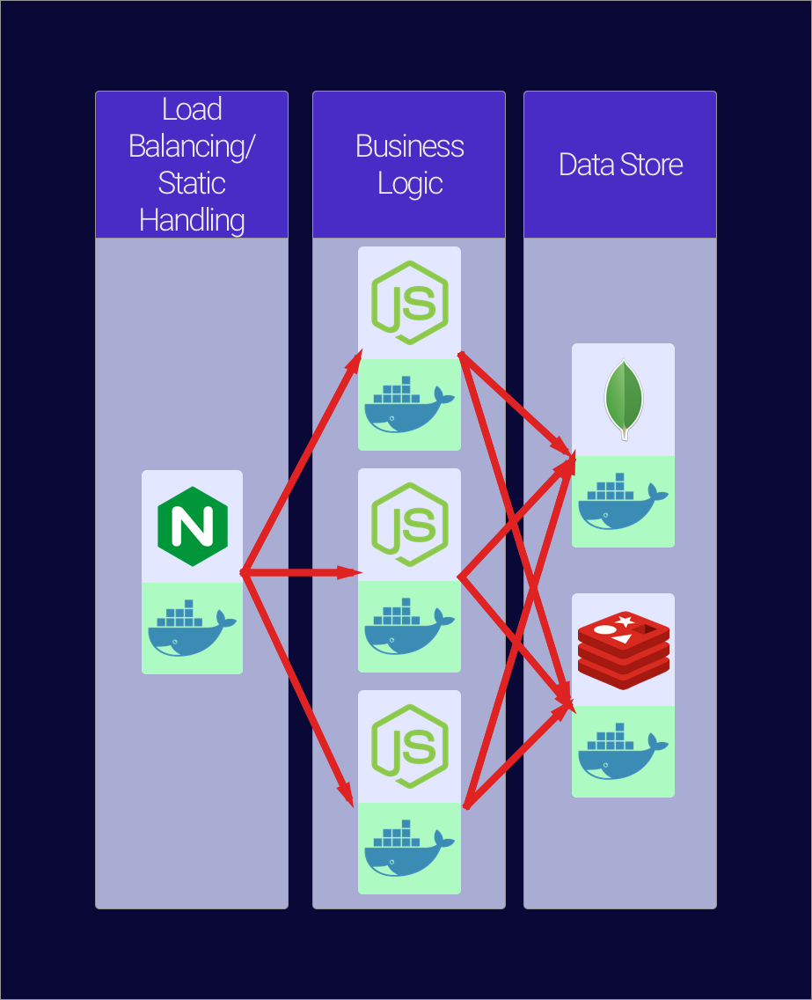
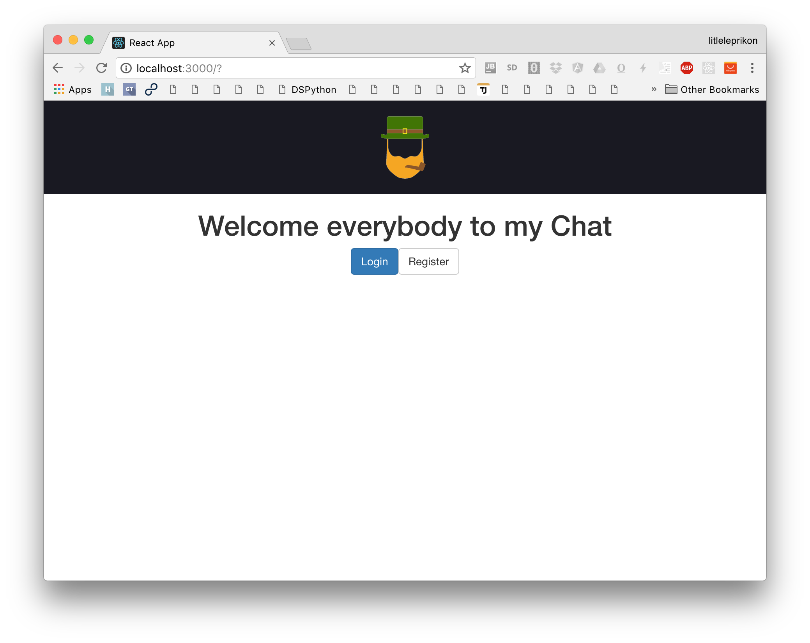
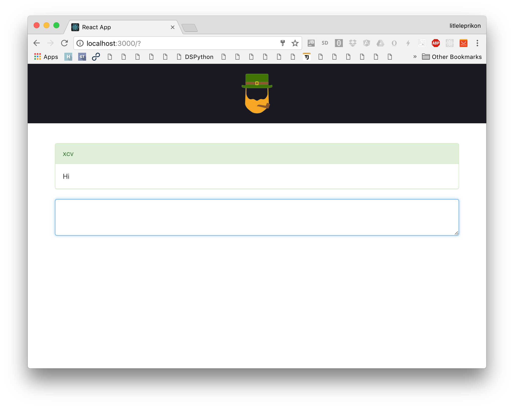

# DS Individual Project

**Author**: Emil A. Sharifullin 
**Date**:   9 November, 2016  

Chat Application.

### Introduction

This project represents realtime browser chat application. I decided to create it using JavaScript web stack: Node.js, React.js, etc. All code also available in github repo https://github.com/litleleprikon/ds_chat

### Architectural diagrams

 Whole service contains three layers: Balancer, Main Service and Data layer. Every single service runs in it's own docker container.

#### Nginx container

Responsible for all communication with real world. Main purpose is to store and distribute React front-end and also to handle all network communication. If client calls API Nginx proxy it to one of application Node.js servers.

#### Node.js container

The brain of this service. Handles websocket communications and also manages users.

#### Mongo container

Data storage is used to store data about users. 

#### Redis container

Used to allow node js back-ends to communicate between them and share websocket information.

### Information about design decisions you made

This scheme is very redundant because this certain chat will never see billions of users but I made it in academical purposes. In real chat application this is will be necessary to suggest ability to horizontal scaling at first stages of  the development. I used couple of hipster technologies in this project and now I want to proof my choice.

- **React.js** fast and high performance view library that allows to store huge amounts of components on the web-page and save performance.
- **Node.js** have asynchronous event-based approach by default can handle a lot of connections.
- **Nginx** web-server that effectively solve 10k connections problem is the best choice as a load-balancer/front-end server for high-load applications.
- **MongoDB** there are no sensitive data in this project so using NoSQL database is good choice to reach high performance of data storage without hours of setup.
- **Redis** in-memory database allows to share hot data between couple of nodes.

### Documentation how to launch system

To launch the system please clone this repository https://github.com/litleleprikon/ds_chat.git and run ./configure script. After that you can run `docker-compose up` and magic begins.

After that you can use the chat. It will be accessible via localhost:8080

Fistly you must to register in appllication. After it you will be able to login. After login you will se the chat window. Here you can type the text and send it to everyone in chat with `<ctrl>+<enter>`. If you type special service commands you will be able to see the all online users or kick somebody. 

- `/getUsers ` returns list of users
- `/kick <username>` kicks user by username

Your sent message is colored to yellow. Your message, that received by server is colored in green. Other messages are coloured in blue.

  